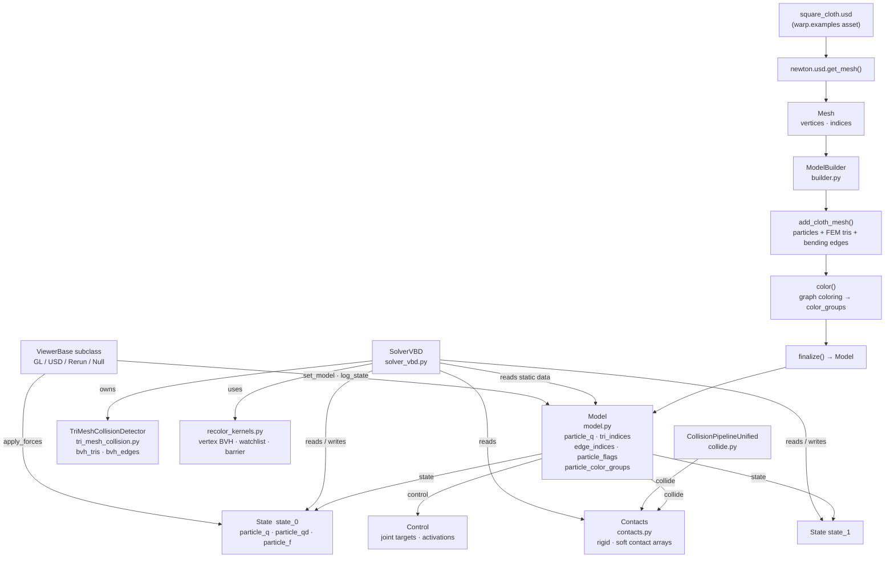
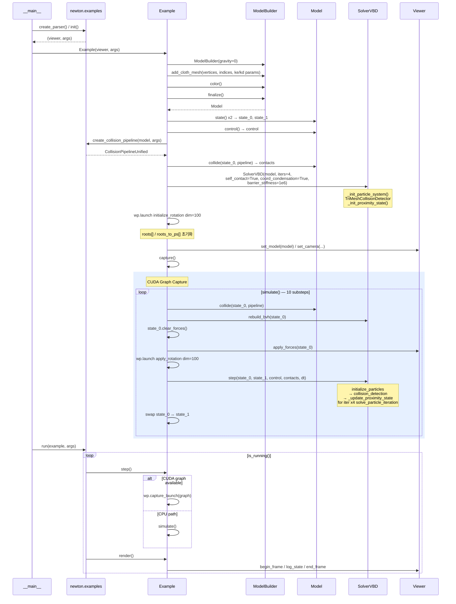
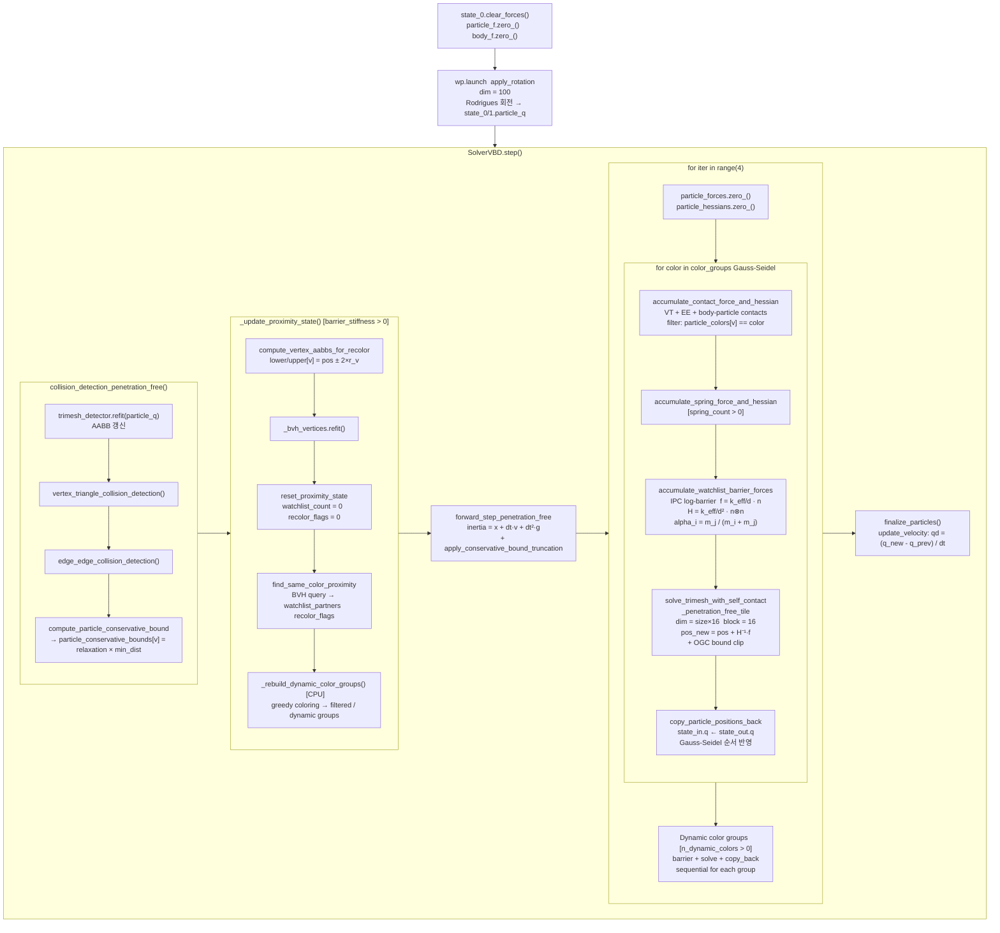
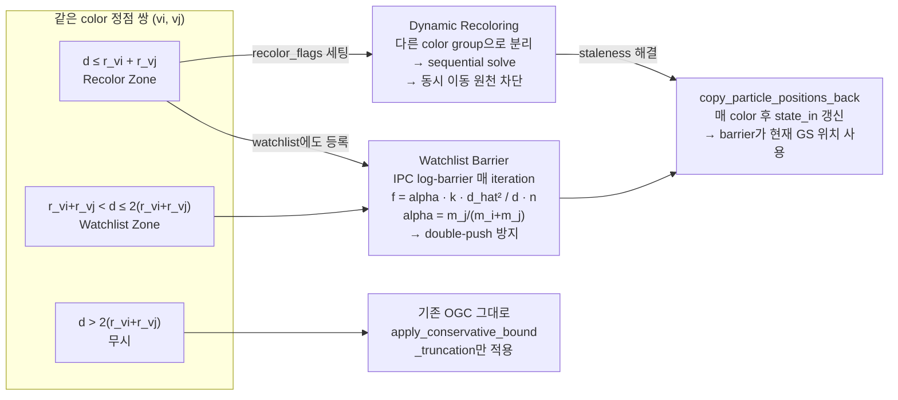

# Code Overview — `example_cloth_twist_reverse.py`

> 정적 분석 기반 코드 구조 문서 (실제 실행 없이 코드 리딩으로 작성)

---

## A. Executive Overview

`example_cloth_twist_reverse.py`는 50×50 정사각형 클로스 메시를 양쪽 끝에서 반대 방향으로 비트는 자기충돌 시뮬레이션이다.

- **메시 로드**: USD 파일(`square_cloth.usd`)에서 정점/삼각형 인덱스를 추출한다.
- **씬 구성**: `ModelBuilder`로 FEM 클로스(삼각형 탄성 + 이면각 굽힘)를 빌드하고, VBD용 그래프 컬러링(`color()`) 후 `Model`로 확정(`finalize()`)한다.
- **경계 조건**: 양쪽 가장자리 100개 정점의 `ACTIVE` 비트를 해제해 고정하고, 매 substep마다 `apply_rotation` 커널이 Rodrigues 회전 행렬을 직접 적용한다.
- **물리 솔버**: `SolverVBD`(Vertex Block Descent)가 4회 Gauss-Seidel 반복으로 암묵적 FEM 적분을 수행한다.
- **자기충돌 방지**: OGC 보수적 바운드 + watchlist IPC barrier + dynamic recoloring 3중 구조로 interpenetration-free를 보장한다.
- **CUDA 그래프**: 10 substep 전체를 `wp.ScopedCapture`로 캡처하여 매 프레임 `wp.capture_launch()` 1회로 재생한다.
- **렌더링**: `ViewerBase` 서브클래스(GL/USD/Rerun/Null)가 매 프레임 `log_state()`로 결과를 출력한다.

---

## B. Mermaid Diagrams

### B-1. High-Level Architecture



---

### B-2. Execution Call Flow (Sequence Diagram)



---

### B-3. Kernel / GPU Operation Flow (1 Substep)



---

### B-4. OGC + Barrier 취약점 대응 구조



---

## C. 주요 파일/클래스 표

| File | Class / Function | Role | Called by | Calls / Dependencies | Notes |
|------|-----------------|------|-----------|---------------------|-------|
| `example_cloth_twist_reverse.py` | `Example` | 씬 전체 오케스트레이션 | `__main__` | ModelBuilder, SolverVBD, Model, Viewer | 씬 진입점 |
| `example_cloth_twist_reverse.py` | `initialize_rotation` *(wp.kernel)* | 회전 기준점 초기화 | `Example.__init__` | `pos`, `rot_centers`, `rot_axes` → `roots`, `roots_to_ps` | dim=100, 1회 실행 |
| `example_cloth_twist_reverse.py` | `apply_rotation` *(wp.kernel)* | 매 substep 고정 정점 위치 갱신 | `Example.simulate` | Rodrigues 회전 행렬 → `state_0/1.particle_q` | 5π 전진 후 역방향 |
| `newton/examples/__init__.py` | `create_parser()` | CLI 인자 파서 | `__main__` | argparse | `--device`, `--viewer` 등 |
| `newton/examples/__init__.py` | `init(parser)` | Viewer 초기화 | `__main__` | ViewerGL/USD/Rerun/Null 선택 | `(viewer, args)` 반환 |
| `newton/examples/__init__.py` | `run(example, args)` | 메인 루프 | `__main__` | `example.step()`, `example.render()` | NaN 체크 포함 |
| `newton/examples/__init__.py` | `create_collision_pipeline()` | 충돌 파이프라인 생성 | `Example.__init__` | `CollisionPipelineUnified.from_model()` | unified / standard 분기 |
| `newton/_src/sim/builder.py` | `ModelBuilder` | 씬 정적 데이터 빌더 | `Example.__init__` | `add_cloth_mesh`, `color`, `finalize` | `color()` 필수 전처리 |
| `newton/_src/sim/builder.py` | `add_cloth_mesh()` | FEM 클로스 추가 | `ModelBuilder` | 정점→particle, 삼각형→FEM, 엣지→bending | density×area→mass |
| `newton/_src/sim/builder.py` | `color()` | 그래프 컬러링 | `ModelBuilder` | MCS/greedy → `particle_color_groups` | VBD solver 필수 |
| `newton/_src/sim/builder.py` | `finalize()` | Model 생성 | `ModelBuilder` | GPU 전송 → `Model` 반환 | 이후 Builder 수정 불가 |
| `newton/_src/sim/model.py` | `Model` | 정적 시뮬레이션 정의 | `finalize()` | `state()`, `control()`, `collide()` | `particle_flags` 포함 |
| `newton/_src/sim/model.py` | `Model.collide()` | 강체 충돌 감지 | `Example.simulate` | `CollisionPipeline.collide()` → `Contacts` | 매 프레임 갱신 |
| `newton/_src/sim/state.py` | `State` | 시변 상태 (위치/속도/힘) | `Model.state()` | `clear_forces()` | `particle_q`, `particle_qd` |
| `newton/_src/sim/contacts.py` | `Contacts` | 충돌 접촉 데이터 | `Model.collide()` | rigid/soft contact arrays | SolverVBD가 읽음 |
| `newton/_src/solvers/vbd/solver_vbd.py` | `SolverVBD` | VBD 암묵적 솔버 | `Example.__init__` | `_init_particle_system`, `step` | 핵심 물리 엔진 |
| `newton/_src/solvers/vbd/solver_vbd.py` | `rebuild_bvh()` | BVH 전체 재구성 | `Example.simulate` | `TriMeshCollisionDetector.rebuild()` | 매 프레임 호출 |
| `newton/_src/solvers/vbd/solver_vbd.py` | `step()` | 1 substep 물리 계산 | `Example.simulate` | `initialize_particles`, `solve_particle_iteration` | CUDA graph 내부 |
| `newton/_src/solvers/vbd/solver_vbd.py` | `_update_proximity_state()` | watchlist + recolor 갱신 | `initialize_particles` | GPU 5개 커널 + CPU greedy coloring | substep마다 1회 |
| `newton/_src/solvers/vbd/tri_mesh_collision.py` | `TriMeshCollisionDetector` | 자기충돌 BVH 관리 | `SolverVBD.__init__` | `bvh_tris`, `bvh_edges`, collision kernels | refit vs rebuild |
| `newton/_src/solvers/vbd/recolor_kernels.py` | `find_same_color_proximity` *(wp.kernel)* | 동색 정점 근접 탐지 | `_update_proximity_state` | vertex BVH query → watchlist/recolor flags | dim=particle_count |
| `newton/_src/solvers/vbd/recolor_kernels.py` | `accumulate_watchlist_barrier_forces` *(wp.kernel)* | IPC barrier 힘 누적 | `solve_particle_iteration` | `particle_forces`, `particle_hessians` | α=m_j/(m_i+m_j) |
| `newton/_src/solvers/vbd/particle_vbd_kernels.py` | `solve_trimesh_with_self_contact_penetration_free_tile` *(wp.kernel)* | 타일 Newton solve | color loop | 탄성+접촉+barrier → pos_new + OGC clip | tile=16 |
| `newton/_src/solvers/vbd/particle_vbd_kernels.py` | `compute_particle_conservative_bound` *(wp.kernel)* | OGC scalar bound | `collision_detection_penetration_free` | VT/EE min dist → `bounds[v]` | r=relaxation×min_dist |
| `newton/_src/solvers/vbd/particle_vbd_kernels.py` | `copy_particle_positions_back` *(wp.kernel)* | GS 위치 복사 | color loop 끝 | `state_in.q ← state_out.q` | Gauss-Seidel 순서 보장 |
| `newton/_src/usd/__init__.py` | `get_mesh(prim)` | USD 메시 파싱 | `Example.__init__` | `Usd.Prim` → `Mesh(vertices, indices)` | |
| `newton/_src/viewer/viewer_*.py` | `ViewerBase` 서브클래스 | 렌더링/UI | `newton.examples.init()` | `set_model`, `log_state`, `apply_forces` | GL/USD/Rerun/Null |

---

## D. 실행 흐름 단계별 설명

### Step 1 — 진입 및 Viewer 초기화
**파일**: `__main__` → `newton/examples/__init__.py`

```
create_parser()  →  argparse (--device, --viewer, --num-frames 등)
init(parser)     →  args에 따라 ViewerGL / ViewerUSD / ViewerNull 중 선택
                    (viewer, args) 반환
```

---

### Step 2 — 메시 로드
**파일**: `example_cloth_twist_reverse.py:167`

```
Usd.Stage.Open("square_cloth.usd")
  └─ usd_stage.GetPrimAtPath("/root/cloth/cloth")
  └─ newton.usd.get_mesh(usd_prim)
       → Mesh(vertices: ndarray (N,3), indices: ndarray)
```

---

### Step 3 — 씬 빌드 및 Model 생성
**파일**: `newton/_src/sim/builder.py`

```
ModelBuilder(gravity=0)
  └─ add_cloth_mesh(pos, rot, scale=0.01, vertices, indices,
                    tri_ke=1e3, tri_ka=1e3, tri_kd=2e-7,
                    edge_ke=1e-3, edge_kd=1e-4)
       ← 정점 2500개(50×50), 삼각형 FEM element, 이면각 bending edge 생성
       ← density × triangle_area → per-vertex mass
  └─ color()       ← VBD용 그래프 컬러링 (MCS/greedy)
  └─ finalize()    → Model (GPU 배열로 전송)

model.particle_flags:
  양쪽 가장자리 100개 정점 (left_side + right_side)
  flags[v] &= ~ParticleFlags.ACTIVE  →  고정 정점
```

---

### Step 4 — SolverVBD 생성
**파일**: `newton/_src/solvers/vbd/solver_vbd.py:210`

```python
SolverVBD(model, iterations=4,
          particle_enable_self_contact=True,
          particle_self_contact_radius=0.002,
          particle_self_contact_margin=0.0035,
          coordinate_condensation=True,
          watchlist_barrier_stiffness=1e6)
```

내부 할당 (`_init_particle_system`):

| 배열 | 역할 |
|------|------|
| `particle_q_prev` | substep 이전 위치 (속도 계산용) |
| `inertia` | 관성 예측 위치 |
| `particle_conservative_bounds` | OGC scalar bound r_v |
| `pos_prev_collision_detection` | OGC 기준점 (substep 시작 시 고정) |
| `_vx_aabb_lower/upper` | watchlist vertex BVH AABB |
| `_watchlist_partners` | 근접 동색 정점 캐시 [v×16] |
| `_watchlist_count` | 캐시 크기 |
| `_recolor_flags` | recolor 필요 여부 |
| `particle_forces` | 접촉+스프링+barrier 힘 누적 |
| `particle_hessians` | Hessian 누적 |
| `cubature_face_weights` | JGS2 cubature 가중치 |

---

### Step 5 — 상태 및 충돌 초기화
**파일**: `newton/_src/sim/model.py`, `contacts.py`

```
state_0 = model.state()    # particle_q, particle_qd 복제
state_1 = model.state()
control = model.control()
collision_pipeline = create_collision_pipeline(model, args)
contacts = model.collide(state_0, pipeline)  # Contacts 객체
```

---

### Step 6 — 회전 기준점 초기화
**파일**: `example_cloth_twist_reverse.py:240`

```
wp.launch(initialize_rotation, dim=100)
  입력: rot_point_indices, state_0.particle_q, rot_centers, rot_axes
  출력: roots[100], roots_to_ps[100]   (회전 시 기준 벡터)
  부작용: t[0] = 0.0
```

---

### Step 7 — CUDA 그래프 캡처
**파일**: `example_cloth_twist_reverse.py:262`

```python
with wp.ScopedCapture() as capture:
    self.simulate()   # ← 이 전체가 그래프로 녹화됨
self.graph = capture.graph
```

`simulate()` 내부 구조:
```
model.collide(state_0, pipeline)       # 강체 충돌
solver.rebuild_bvh(state_0)            # BVH 전체 재구성

for _ in range(10):  # sim_substeps
    state_0.clear_forces()
    viewer.apply_forces(state_0)
    wp.launch(apply_rotation, dim=100)  # 회전 적용
    solver.step(state_0, state_1, control, contacts, dt)
    state_0, state_1 = state_1, state_0  # 더블 버퍼 스왑
```

---

### Step 8 — 1 Substep 내부 (`SolverVBD.step`)
**파일**: `newton/_src/solvers/vbd/solver_vbd.py`

```
① collision_detection_penetration_free()
     refit BVH → VT/EE 탐지 → compute_particle_conservative_bound
     pos_prev_collision_detection ← state_in.particle_q  (기준점 고정)

② _update_proximity_state()
     compute_vertex_aabbs_for_recolor   [GPU]
     _bvh_vertices.refit()              [GPU]
     reset_proximity_state              [GPU]
     find_same_color_proximity          [GPU]  BVH 쿼리 → watchlist + recolor_flags
     _rebuild_dynamic_color_groups()    [CPU]  greedy coloring → dynamic groups
     (CUDA graph capture 중: is_capturing=True → CPU 부분 skip)

③ forward_step_penetration_free()
     inertia = x + dt·v + dt²·g
     apply_conservative_bound_truncation  (OGC clip)

④ for iter in range(4):  [Gauss-Seidel]
     particle_forces.zero_()
     for color in color_groups:
       accumulate_contact_force_and_hessian()    VT+EE+body-particle
       accumulate_spring_force_and_hessian()
       accumulate_watchlist_barrier_forces()     IPC barrier
       solve_trimesh_with_self_contact_penetration_free_tile()
         → pos_new = pos + H⁻¹·f + OGC clip
       copy_particle_positions_back()            GS 업데이트
     [dynamic color groups sequential solve]

⑤ finalize_particles()
     qd = (q_new - q_prev) / dt
```

---

### Step 9 — 메인 루프 (매 프레임)
**파일**: `newton/examples/__init__.py`

```
while viewer.is_running():
    example.step()          ← wp.capture_launch(graph)  또는  simulate()
    example.render()        ← viewer.log_state(state_0)
    sim_time += frame_dt
```

---

## E. 불확실한 부분

| 항목 | 내용 | 확인 방법 |
|------|------|-----------|
| `coordinate_condensation=True` 실제 경로 | `True`로 설정했으나, `self_contact=True` 경로는 `solve_trimesh_with_self_contact_*` 커널을 사용하고, coord_condensation 분기는 `no_self_contact` 커널에만 존재할 가능성이 있음 (추정) | `particle_vbd_kernels.py`의 `solve_trimesh_with_self_contact_*` 내부 확인 |
| `bvh_rebuild_frames = 10` 사용 여부 | 씬에서 `self.bvh_rebuild_frames = 10`을 선언하지만, `simulate()`에서 `rebuild_bvh()`를 매 프레임 무조건 호출함 — 이 변수가 실제로 사용되는 위치 불명확 | `solver_vbd.py`의 `rebuild_bvh()` 및 이 속성 참조 위치 검색 |
| Dynamic recoloring 발생 시점 | `watchlist_barrier_stiffness=1e6`으로 활성화되어 있으나, 실제 자기충돌이 발생하기 전에는 `_n_dynamic_colors=0`일 가능성이 높음 | 런타임 `solver._n_dynamic_colors` 값 모니터링 또는 로그 추가 |
| `viewer.apply_forces()` 구현 | ViewerBase 서브클래스마다 wind/picking 등 외부 힘 적용 여부가 다름 | 각 Viewer 서브클래스 구현 확인 |
| `square_cloth.usd` 실제 정점 수 | 코드상 `cloth_size=50` → 50×50=2500 정점으로 추정, USD 파일 실제 해상도 미확인 | USD 파일 열람 또는 런타임 `mesh_points.shape` 출력 |
| `create_collision_pipeline()` 분기 조건 | `args.collision_pipeline` 값에 따라 unified/standard 파이프라인 선택 — 씬 기본값 미확인 | `examples/__init__.py:398` + CLI 기본값 확인 |
| CUDA graph + proximity guard 상호작용 | `is_capturing=True`일 때 `_rebuild_dynamic_color_groups()` skip — 캡처 후 첫 replay 시 dynamic groups가 pre-capture 결과에 의존 | 그래프 캡처 직전 normal step 1회 실행 여부 확인 (씬 코드상 `capture()` 전 `step()` 미호출) |

---

*작성: 정적 코드 분석 기반 / 실제 실행 없이 파일 리딩으로 작성*
