# VBD Artificial Damping Ablation Study (with Figures)

**Date**: 2026-06-09
**Branch**: `claude/step2-dyanmic_recoloring_ogc`
**Device**: NVIDIA GeForce RTX 4090 (cuda:1)
**Solver**: Newton VBD — Planar-DAT (arXiv:2604.15513), OGC contact mode

> **Note**: This is a figure-annotated copy of
> [`vbd_damping_ablation_report.md`](vbd_damping_ablation_report.md). All
> text and tables are identical to the original report; this version adds
> scene snapshots (rendered with matplotlib `Poly3DCollection`, no
> GL/pyglet) and time-series plots (generated from the existing
> `runs/ablation_*/diagnostics.npz` logs) at the points where they are
> most relevant, each with a detailed caption. Figures were produced by
> `scripts/generate_report_figures.py` and
> `scripts/capture_scene_screenshots.py`; see
> [figures/](figures/) and [figures/scenes/](figures/scenes/).

---

## 1. Motivation

Vertex Block Descent (VBD) is an implicit solver that iterates over graph-colored vertex groups. Real-time garment simulation requires the solver to run with a limited iteration budget (typically 10–100). This study quantifies *how much* artificial damping the solver produces, and *which pipeline stage* is responsible, under four qualitatively different contact conditions.

**Damping source candidates**:

| # | Source | Hypothesis |
|---|--------|-----------|
| 1 | Implicit time integration | Backward-Euler velocity back-calculation dissipates energy structurally |
| 2 | Solver under-convergence | Insufficient iterations → residual force → net work done on cloth |
| 3 | Planar-DAT truncation | Conservative bounds clip inertia displacement → KE removed |
| 4 | Tangential displacement clipping | Truncation removes contact-tangential motion |
| 5 | Contact topology / OGC recoloring | Graph changes alter solver convergence path |

---

## 2. Methodology

### 2.1 Diagnostic Hooks

A `VBDDiagnostics` class was instrumented into `SolverVBD.step()` at four checkpoints per substep:

```
before_prediction → after_prediction → [before/after_truncation] → after_solver → end_of_step
```

At each checkpoint: kinetic energy (KE), stretch energy (StVK), bending energy (dihedral), gravitational PE, linear/angular momentum, COM, solver residual, contact count, truncation statistics.

**Truncation analysis** (`on_before/after_truncation`): per-substep ΔKE, ΔE, Δmomentum, R_normal / R_tangent decomposition of removed displacement.

All diagnostics are **disabled by default**; no change to solver behavior when off.

### 2.2 Ablation Matrix

For each scene × iteration count, four variants were run:

| Variant | `particle_enable_self_contact` | `use_planar_dat` | `no_friction` |
|---------|-------------------------------|-----------------|--------------|
| `full`       | ✓ | ✓ | — |
| `no_contact` | ✗ | ✗ | — |
| `no_trunc`   | ✓ | ✗ | — |
| `no_friction`| ✓ | ✓ | ✓ |

**Note**: `dynamic_recoloring=False` in all variants (not passed to the solver constructor; defaults off). The `>>> OGC Contact mode ON <<<` message refers to the collision *detection* algorithm (OGC vs. standard BVH query), not graph recoloring. Therefore `full − no_trunc` isolates **Planar-DAT only** without dynamic recoloring.

### 2.3 Iteration and Substep Sweeps

**Iteration sweep** (§3–§6): `iterations ∈ {10, 50, 100, 500}`, `substeps = 10`, `fps = 60`, `dt = 1/600 s ≈ 1.667 ms`.

**Substep sweep** (§7.5): `substeps ∈ {2, 5, 10, 20, 40}`, `iterations = 100`, `fps = 60`, `dt = 1/(60 × substeps) s`. All four ablation variants run for Scenes A and B only. The substep sweep varies dt while keeping the total simulated time fixed (30 frames = 0.5 s), so each row represents a different per-substep timestep.

### 2.4 Scenes

| ID | Name | Description | Duration | Self-contact |
|----|------|-------------|----------|-------------|
| A | `no_contact_oscillation` | 24×24 cloth, 2 fixed corners, initial z-displacement | 30 frames (0.5 s) | None |
| B | `frictionless_sliding` | Two 24×24 cloth layers, top slides on fixed bottom, μ=0 | 30 frames (0.5 s) | Sustained (~400 pairs) |
| C | `separating_contact` | Tent-shaped cloth, self-contacts then separates | 30 frames (0.5 s) | Brief (~30 pairs) |
| D | `twist_release` | Square cloth, corners twisted to t=10 s then released | 720 frames (12 s) | Massive (~40,000 pairs) |

---

## 3. Scene A — No-Contact Oscillation

**Setup**: Cloth suspended by 2 fixed corners, displaced vertically, released under gravity. No self-contact pipeline.

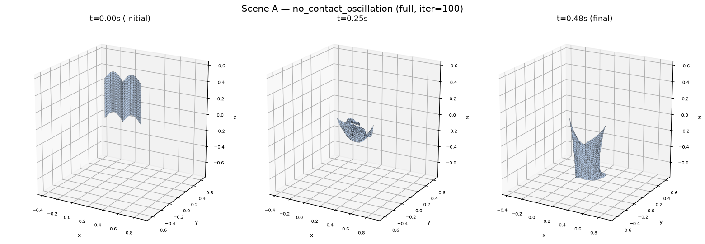

**Figure 1.** Scene A (`no_contact_oscillation`) mesh snapshots at t=0.00s, 0.25s, and 0.48s (full variant, iter=100). The 24×24 grid is suspended from two fixed corners (top edge) and given an initial out-of-plane "double-bump" displacement (z ∝ sin(π·r/r_max)). By t=0.25s the cloth has folded into a compact, crumpled configuration as the initial bumps collapse inward; by t=0.48s it has settled into an elongated, mostly-flat hanging sheet. This visual collapse from a high-curvature initial shape to a low-curvature final shape is the geometric counterpart of the 97.9% total-energy loss reported in §3.1/§3.3 — most of the initial stretch and gravitational potential energy has been dissipated by the solver's structural implicit damping rather than converted into large-scale oscillation.

### 3.1 Energy Decay

| iter | E_initial (J) | E_final (J) | E retained | residual_mean (N) | wall time |
|------|--------------|------------|-----------|------------------|-----------|
| 10   | 284.4 | 6.23 | **2.2%** | 3.385 | 2.9 s |
| 50   | 284.4 | 5.90 | **2.1%** | 3.390 | 5.5 s |
| 100  | 284.4 | 5.89 | **2.1%** | 3.387 | 9.1 s |
| 500  | 284.4 | 5.91 | **2.1%** | 3.391 | 35.1 s |

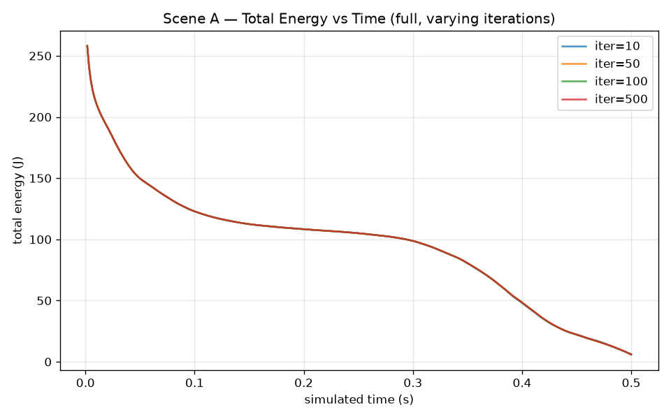

**Figure 2.** Total energy (`end_of_step/total_energy`) vs. simulated time for Scene A, `full` variant, overlaid for iter ∈ {10, 50, 100, 500}. X-axis: simulated time (s), 0–0.5s (300 substeps at dt=1/600s). Y-axis: total energy (J). All four curves are visually indistinguishable — they overlap to within 0.56J over the full 300-substep trajectory (§3.3 finding 2). The curve decreases smoothly and monotonically from ≈260J to ≈6J, i.e., the 97.9% loss from §3.1 is gradual rather than a single discrete event. The fact that iter=10 and iter=500 produce the same trajectory is direct visual evidence that the VBD solver has already reached its fixed point well within 10 iterations for this scene, so the damping is not a convergence artifact but a property of the per-substep update itself.

### 3.2 Per-substep Energy Budget

| Stage | ΔKE / substep | ΔE_total / substep |
|-------|--------------|-------------------|
| Prediction (inertia extrapolation) | +0.743 J | +0.653 J |
| VBD solver | −0.560 J | **−1.582 J** |

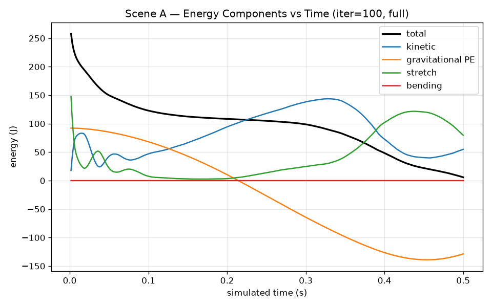

**Figure 3.** Energy component breakdown for Scene A, iter=100, `full`: total energy (black, bold), kinetic energy (blue), gravitational PE (orange), stretch energy (green), bending energy (red, ≈0 throughout) — all `end_of_step` values vs. simulated time. At t=0 the initial "double-bump" shape stores ≈150J of stretch energy and ≈95J of gravitational PE, for a total of ≈260J. As the cloth relaxes, stretch energy drops sharply (the bumps flatten) while kinetic energy rises with damped oscillation, visible as ringing in KE between t=0–0.1s. Gravitational PE decreases monotonically as the cloth's center of mass falls. Around t≈0.35–0.45s a second stretch-energy peak (≈120J) appears as the cloth swings into a new folded configuration. Throughout, `total = KE + gPE + stretch + bending` decreases monotonically even though individual components rise and fall — each local exchange between KE, stretch, and gravitational PE loses a fraction of its magnitude to the solver's implicit damping, which is the per-substep mechanism behind the §3.1 energy-decay curve and the §3.2 per-substep budget above.

### 3.3 Findings

1. **97.9% energy is lost in 0.5 s** with 100 iterations and no contact.
2. **Iteration count has no effect**: iter=10 and iter=500 produce identical energy profiles (max difference 0.56 J over 300 substeps, 0.03%).
3. **Residuals do not decrease with more iterations**: mean residual ≈ 3.39 N for iter=10 through iter=500, confirming the solver reaches its fixed point in fewer than 10 iterations.
4. **All energy loss occurs in the VBD solver stage**, not in prediction.

**Conclusion**: The dominant damping source in Scene A is **structural implicit damping** from the backward-Euler–style velocity back-calculation `v = (q_new − q_old) / dt`. This is an intrinsic property of the time integration scheme, independent of iteration count.

---

## 4. Scene B — Frictionless Sliding

**Setup**: Two 24×24 cloth layers. Bottom layer pinned at corners. Top layer slides on bottom under gravity. No friction (μ=0). Planar-DAT active.

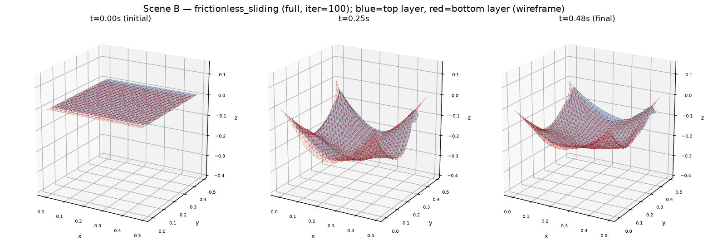

**Figure 4.** Scene B (`frictionless_sliding`) mesh snapshots at t=0.00s, 0.25s, and 0.48s (full variant, iter=100). Blue = top layer (free, 625 vertices, solid fill), red/salmon = bottom layer (625 vertices, pinned at its four corners, rendered as a semi-transparent wireframe so the nested blue layer remains visible underneath/inside it). At t=0 the two layers are nearly flat and separated by 0.04m. By t=0.25s both layers have sagged under gravity into matching bowl shapes, and the solid blue surface is visible nested just inside the red wireframe bowl — i.e., self-contact has engaged. The top (free) layer's z-range (−0.187 to −0.028 m) sits almost entirely within the bottom (pinned) layer's wider z-range (−0.187 to 0.0 m, the upper bound set by its pinned corners), confirming that the blue layer has settled into the bowl formed by the red layer. By t=0.48s the configuration is essentially static, matching the near-zero `end_of_step/kinetic_energy` (≈1.28J) reported in §4.1, with the blue surface still conforming closely to the inner contour of the red wireframe bowl. This nested-bowl geometry is the direct visual evidence of the sustained contact between the two layers described in §2.4 ("Sustained, ~400 pairs").

### 4.1 Energy Decomposition at Final Frame (iter=100)

| Variant | KE (J) | grav PE (J) | stretch (J) | total (J) | Interpretation |
|---------|--------|------------|------------|----------|----------------|
| `full`       | 1.28 | −88.1 | 21.2 | −65.6 | Cloth settled on surface |
| `no_contact` | 356.4 | −365.5 | 0.8 | −8.2 | Free fall through bottom layer |
| `no_trunc`   | 1.00 | −92.1 | 22.2 | −68.9 | Slightly lower, more stretch |
| `no_friction`| 1.28 | −88.4 | 21.5 | −65.9 | ≈ full (scene is frictionless anyway) |

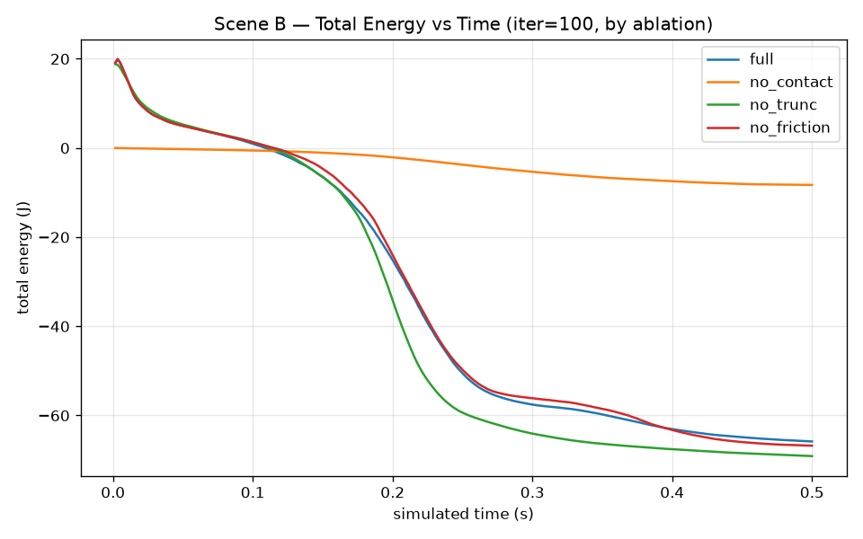

**Figure 5.** Total energy vs. simulated time for Scene B, iter=100, overlaid for all four ablation variants. All curves start at ≈+20J. `full` (blue), `no_trunc` (green), and `no_friction` (red) track each other closely, dropping through a steep transition around t=0.15–0.25s — the moment the top layer makes sustained contact with the bottom layer (cf. Figure 4) — down to final values of −65.8J, −69.1J, and −66.8J respectively. `no_trunc` ends about 3J lower than `full`, consistent with the `full − no_trunc = +3.3J` entry for iter=100 in the §7.2 isolation table. `no_contact` (orange) stays close to its initial value (drifting only to ≈−8J) because, with no contact constraints, gravitational PE loss and kinetic energy gain approximately cancel during free fall — total energy is nearly conserved. The ≈85J gap between `no_contact` and the other three variants quantifies how much energy the contact pipeline (truncation plus structural damping combined) removes once the layers interact.

### 4.2 Planar-DAT Truncation vs. Iteration Count

| iter | n_truncated | frac % | ΔKE_trunc / substep | ΔE_trunc / substep | tang_frac | trunc_scale_min |
|------|------------|--------|--------------------|--------------------|-----------|----------------|
| 10  | 78.3  | 6.3%  | −0.272 J | −0.209 J | 0.429 | 0.237 |
| 50  | 103.1 | 8.2%  | −0.984 J | −0.837 J | 0.418 | 0.160 |
| 100 | 118.3 | 9.5%  | −1.414 J | −1.247 J | 0.420 | 0.126 |
| 500 | 127.6 | 10.2% | −1.781 J | −1.584 J | 0.413 | 0.112 |

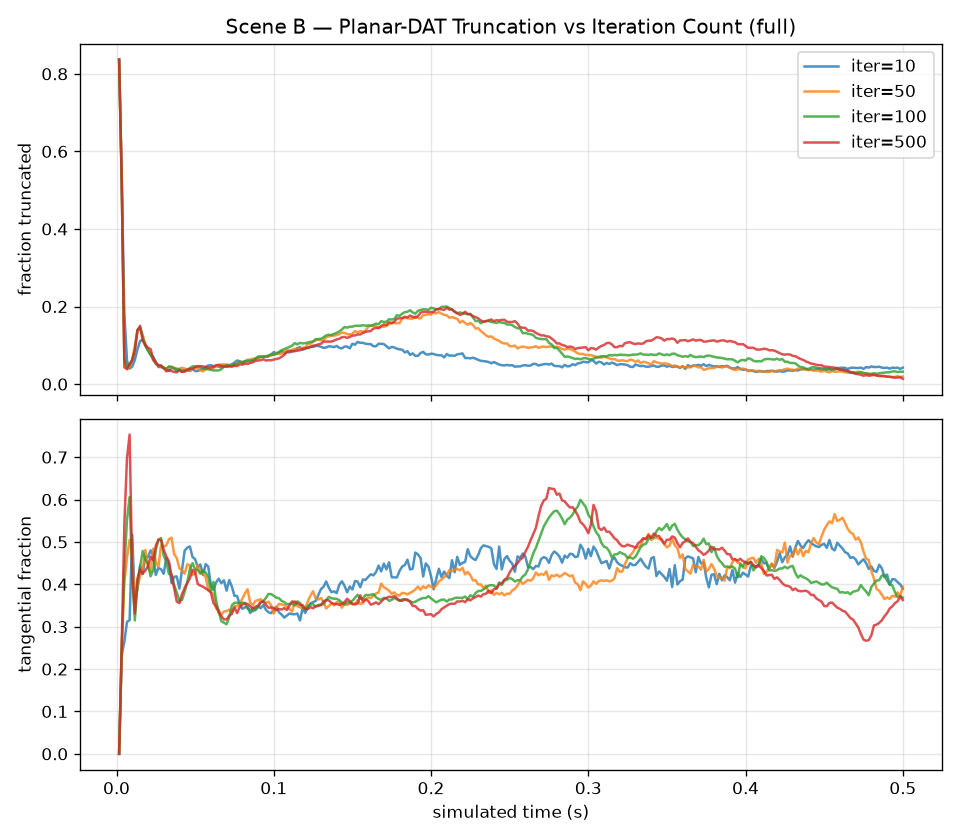

**Figure 6.** Planar-DAT truncation statistics for Scene B, `full`, overlaid for iter ∈ {10, 50, 100, 500}. Top panel: `truncation/fraction_truncated` vs. time. After an initial transient spike (t≈0, fraction≈0.84, from the very first substep while both layers are still settling into place), the fraction drops to a baseline ≈0.04 and then rises to a broad peak ≈0.18–0.2 around t=0.2s — exactly when the layers make sustained contact (cf. Figure 5). iter=10 (blue) reaches a visibly lower peak (≈0.1) than iter=50/100/500 (≈0.2), the time-series counterpart of the `n_truncated` values in the table above increasing from 78.3 (iter=10) to 127.6 (iter=500). Bottom panel: `truncation/tangential_fraction` vs. time, which is noisy but oscillates around ≈0.4 for all four iteration counts from t≈0.1s onward — visual confirmation of the "tangential fraction ≈ 0.41–0.43, constant across iteration counts" claim in §4.3/§7.3.

### 4.3 Findings

1. **More iterations → more truncation → more energy loss.** With 500 iterations, Planar-DAT removes 1.78 J of KE per substep, vs. only 0.27 J at 10 iterations.
2. **Tangential fraction ≈ 0.42 (constant)**. Even with μ=0 (no friction force), 42% of removed displacement is tangential to the contact normal. Planar-DAT acts as an implicit friction-like damper in the sliding direction.
3. **`delta_linear_momentum_z > 0`**: Truncation injects upward normal-direction momentum (cloth pushed away from surface), while removing KE overall — a non-conservative impulse.
4. The `no_contact` variant shows extreme KE (356 J at t=0.5 s) from free fall, confirming that contact constraints are essential to limit cloth motion.

**Conclusion**: In sustained-contact scenarios, **Planar-DAT truncation is the primary energy dissipation mechanism beyond structural implicit damping**, and its magnitude scales with iteration count.

---

## 5. Scene C — Separating Contact

**Setup**: Single cloth in a shallow tent shape (z-displacement), one edge pinned. Cloth self-contacts briefly (~frames 27–29) then separates.

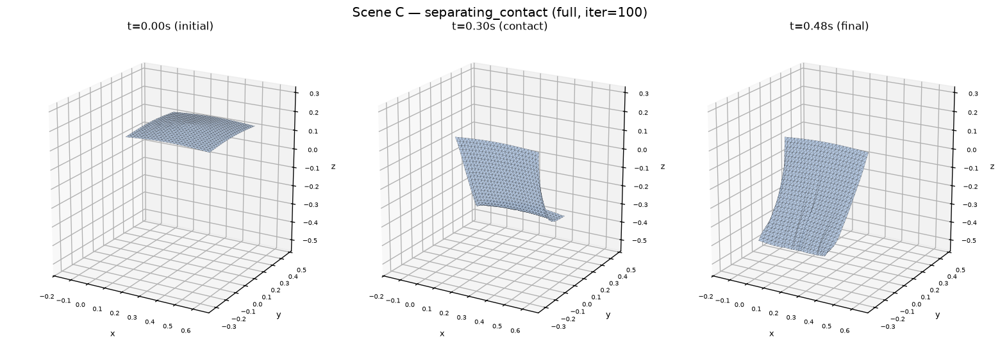

**Figure 7.** Scene C (`separating_contact`) mesh snapshots at t=0.00s, 0.30s, and 0.48s (full variant, iter=100). The cloth starts in a shallow tent shape (z ∝ 1 − r/r_max from the center) with one edge pinned. By t=0.30s the cloth has folded over and curled, bringing opposite regions of the sheet into self-contact — the "brief contact" phase referenced in §5's setup description. By t=0.48s the cloth has separated again into a smoothly curved, non-self-intersecting sheet. This fold-then-separate cycle is the geometric event whose energy signature is shown in Figures 8 and 9.

### 5.1 Convergence vs. Iteration Count (full variant)

| iter | E_initial (J) | E_final (J) | E retained | n_contacts (mean) |
|------|--------------|------------|-----------|------------------|
| 10  | 34.71 | 9.91  | **28.5%** | 0.09 |
| 50  | 34.71 | 23.09 | **66.5%** | 1.47 |
| 100 | 34.71 | 23.08 | **66.5%** | 1.18 |
| 500 | 34.71 | 23.09 | **66.5%** | 1.41 |

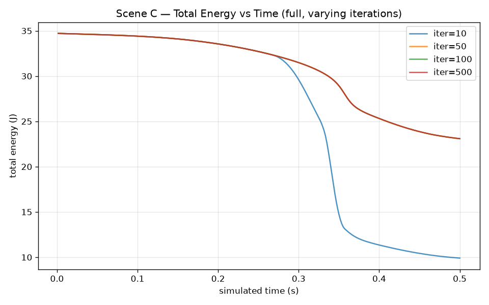

**Figure 8.** Total energy vs. simulated time for Scene C, `full`, overlaid for iter ∈ {10, 50, 100, 500}. iter=50/100/500 are visually identical, following a smooth curve from 34.7J down to 23.1J (matching the 66.5%-retention rows above). iter=10 (blue) tracks this same curve until t≈0.28s, then breaks away with a steep additional drop (≈32J → ≈13J over t≈0.28–0.36s) before leveling off near 9.9J. This is the "iter=10 anomaly" of §5.2: the divergence begins around t≈0.28s (frame≈17), well before any contact pairs are recorded (`n_contacts=0` at that point), because the Planar-DAT conservative bound starts truncating displacement in anticipation of proximity that the under-resolved (iter=10) solver cannot otherwise handle.

### 5.2 Iter=10 Anomaly (frame 17–21 divergence despite n_contacts=0)

| iter / variant | E at frame 21 (J) |
|---------------|--------------------|
| iter=10, `full`        | 14.18 |
| iter=10, `no_trunc`    | **−0.44** (unstable) |
| iter=10, `no_contact`  | 28.74 |
| iter=100, `full`       | 28.74 |

The divergence starts at frame 17, before any contacts are recorded (n_contacts=0). The Planar-DAT conservative bounds detect proximity before formal contact pairs are generated, and begin truncating inertia displacement. At 10 iterations this under-resolves the contact dynamics.

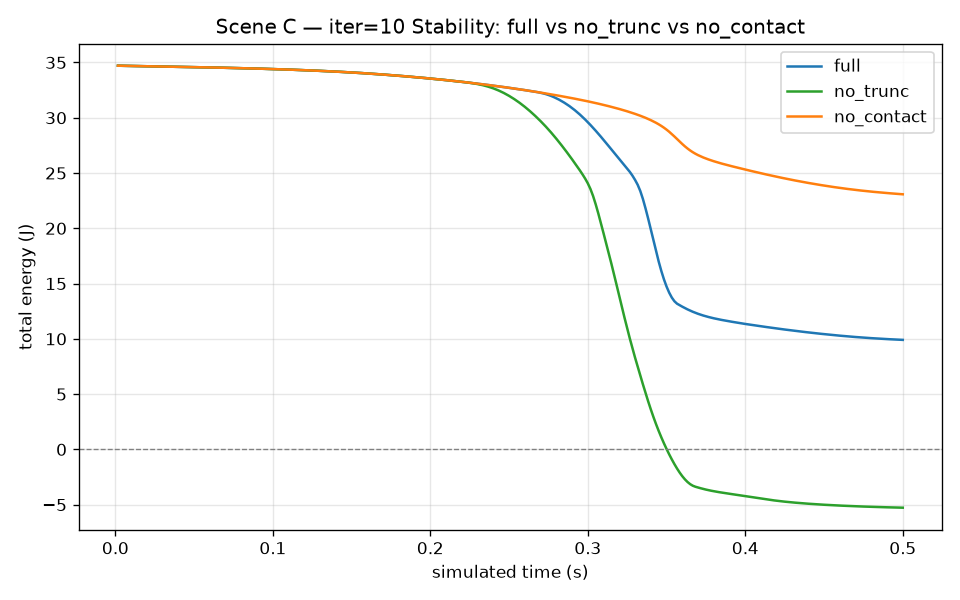

**Figure 9.** Total energy vs. simulated time for Scene C, iter=10, comparing `full` (blue), `no_trunc` (green), and `no_contact` (orange). All three trajectories are identical until t≈0.24s. From there, `no_contact` continues along the smooth converged curve (ending at 23.1J — the same endpoint as the iter≥50 curves in Figure 8, since with contact disabled the under-convergence of iter=10 has no contact forces to mis-resolve). `full` breaks away earlier and drops to 9.9J. `no_trunc` (green) breaks away most steeply, crossing zero near t≈0.35s and ending at −5.27J — a non-physical negative total energy, i.e., numerical instability. This is the direct visualization of the §5.3 finding that Planar-DAT truncation acts as a stabilizer at low iteration counts: removing it (`no_trunc`) turns an already-lossy but bounded trajectory (`full`, 9.9J) into a divergent one (`no_trunc`, −5.27J).

### 5.3 Planar-DAT Role at Low Iterations

| iter | `full` E_f | `no_trunc` E_f | Difference |
|------|-----------|--------------|-----------|
| 10  | 9.91  | **−5.27** | +15.2 J — **truncation stabilizes** |
| 50  | 23.09 | 23.09     | 0 J — truncation irrelevant at convergence |
| 100 | 23.08 | 23.08     | 0 J |
| 500 | 23.09 | 23.09     | 0 J |

### 5.4 Findings

1. **Convergence threshold at iter≈50**: below this, contact forces are under-resolved and energy loss is large.
2. **`no_trunc` at iter=10 is catastrophically unstable** (−5 J final energy): without Planar-DAT's displacement limiting, unresolved contact forces cause particles to overshoot, accumulating large stretch energy or falling through geometry.
3. **Planar-DAT acts as a stabilizer** at low iteration counts for brief-contact scenes.
4. **At iter≥50, contact / truncation have no measurable effect on final energy** (difference < 0.01 J). The contact is brief and resolves cleanly.

**Conclusion**: Scene C reveals a **dual role** of Planar-DAT — damping at high iter/sustained-contact (Scene B), but *stabilization* at low iter/brief-contact. The dominant damping source is solver under-convergence at iter=10 (28.5% vs. 66.5% retention), not truncation.

---

## 6. Scene D — Twist-and-Release

**Setup**: Square cloth from `square_cloth.usd` (14,406 vertices). Two opposite bottom corners are twist-driven at constant angular velocity until t=10 s, then released. Massive self-contact develops during twisting.

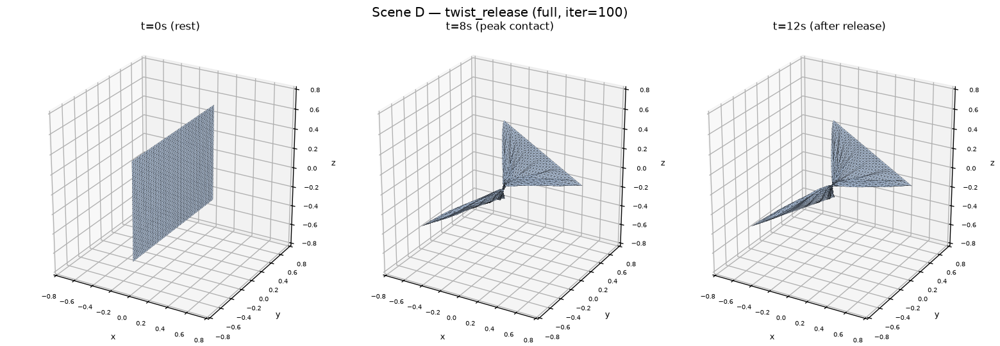

**Figure 10.** Scene D (`twist_release`) mesh snapshots at t=0s (rest), t=8s (peak contact, during twisting), and t=12s (2s after release at t=10s), full variant, iter=100. At t=0 the cloth is a flat sheet. By t=8s the two opposite edges have been twisted, causing the sheet to wind up into a tight, elongated "rope" with a flag-like region at one end — this twisted rope is where the ≈40,000 self-contact pairs reported in the §6.1 t=8s row are concentrated. Note the much smaller spatial extent compared to t=0 (all three panels share the same axis scale, set by the t=0 bounding box). By t=12s, 2s after release, the cloth remains in a similarly twisted/folded configuration — consistent with §6.4's observation that the twisted configuration does not quickly unwind, and that the dominant energy term at this point is elastic potential stored in the self-contact configuration rather than kinetic energy.

### 6.1 Energy Timeline (iter=100, full)

| t (s) | n_contacts | E_full (J) | E_no_contact (J) | Phase |
|-------|-----------|-----------|-----------------|-------|
| 0    | 0      | 0.0   | 0.0   | Rest |
| 1    | 0      | 14.8  | 14.8  | Twist begins |
| 2    | 8,096  | 30.9  | 16.2  | Self-contact onset |
| 5    | 25,798 | 57.3  | 17.7  | Dense contact |
| 8    | 41,642 | 81.5  | 19.4  | Peak contact |
| **10** | **37,273** | **74.3** | **18.9** | **← Release** |
| 11   | 31,123 | 63.3  | 3.0   | Unwinding |
| 12   | 26,813 | 57.6  | 16.8  | Settling |

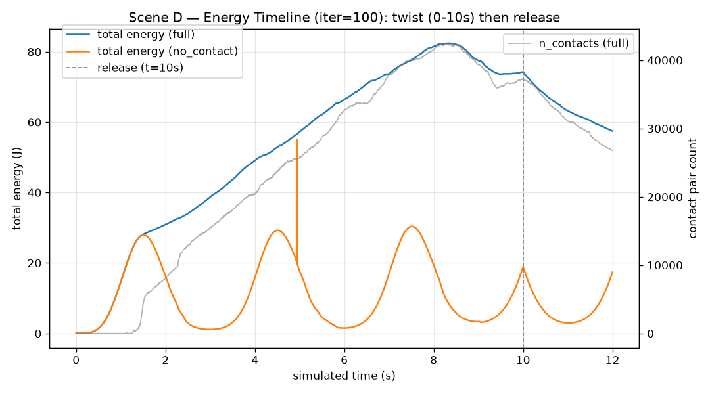

**Figure 11.** Scene D energy/contact timeline, iter=100, 0–12s. Left axis (lines): `end_of_step/total_energy` for `full` (blue) and `no_contact` (orange). Right axis (gray): `end_of_step/n_contacts` for `full`. The dashed vertical line marks the release time (t=10s). `full` total energy rises monotonically and roughly tracks the rising contact count during twisting (0–10s), peaking ≈82J around t=8s (matching the table above), then decreases after release as the cloth unwinds and partially relaxes, ending at ≈57.5J at t=12s. `no_contact` oscillates periodically — the twisted-but-non-colliding cloth behaves like an elastic spring with the layers freely interpenetrating — and stays in the 0–30J range throughout; it never accumulates the large elastic energy that `full` does, because without self-contact the cloth has no mechanism to store energy in a tightly-wound configuration. The sharp vertical jump in the `no_contact` curve near t≈5s reflects a discontinuity already present in the underlying `diagnostics.npz` log for that run and is not an artifact of this plot.

### 6.2 Final Energy (t=12 s) by Iteration Count

| iter | `full` (J) | `no_contact` (J) | `no_trunc` (J) | `no_friction` (J) | full−no_trunc |
|------|-----------|-----------------|--------------|-----------------|--------------|
| 10  | 77.5  | 17.1 | 66.3  | 75.1  | **+11.2** |
| 50  | 70.0  | 17.6 | 70.8  | 69.3  | −0.8 |
| 100 | 57.5  | 17.4 | 69.4  | 72.1  | **−11.9** |
| 500 | 81.5  | 17.3 | 54.7  | 54.3  | **+26.8** |

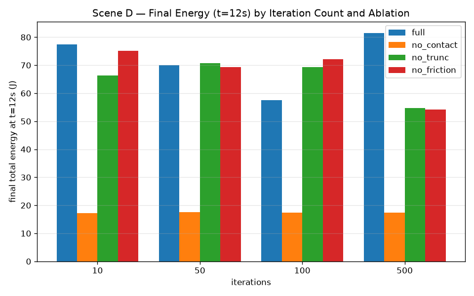

**Figure 12.** Grouped bar chart of final (t=12s) total energy for Scene D, by iteration count (x-axis) and ablation variant (bar color), directly reproducing the table above. `no_contact` (orange) is essentially flat at ≈17.3–17.6J across all iteration counts — without self-contact, the final state is iteration-independent. `full` (blue), `no_trunc` (green), and `no_friction` (red) vary non-monotonically with iteration count: `full` ranges from 57.5J (iter=100, the lowest) to 81.5J (iter=500, the highest), while `no_trunc` decreases monotonically from 66.3J (iter=10) to 54.7J (iter=500). The crossover between `full` and `no_trunc` — `full` is above `no_trunc` at iter=10 and iter=500, but below it at iter=100 — is the visual form of the "non-monotonic full−no_trunc" finding discussed below and in §7.2 (Figure 14), and reflects the sensitivity of the ≈40,000-contact-pair topology to small changes in the per-substep truncation behavior.

### 6.3 Planar-DAT Truncation Statistics (full, 720 frames)

| iter | n_truncated | frac % | tang_frac | ΔKE_trunc / substep (J) |
|------|------------|--------|-----------|------------------------|
| 10  | 31.9  | 1.3% | 0.361 | −3×10⁻⁶ |
| 50  | 64.6  | 2.6% | 0.418 | −1.4×10⁻⁵ |
| 100 | 71.4  | 2.9% | 0.431 | −2.8×10⁻⁵ |
| 500 | 101.7 | 4.1% | 0.407 | −5.8×10⁻⁵ |

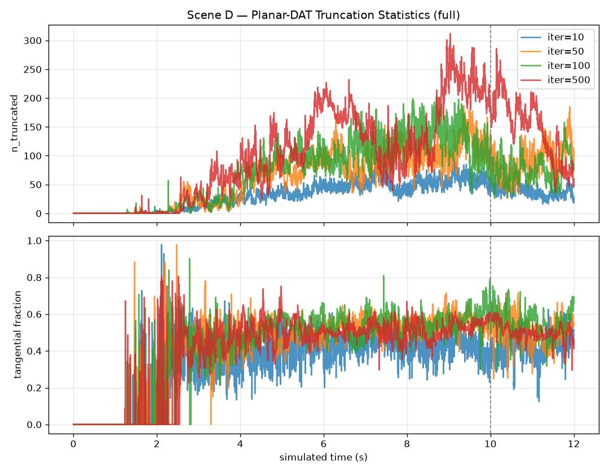

**Figure 13.** Scene D Planar-DAT truncation statistics, `full`, overlaid for iter ∈ {10, 50, 100, 500}, 0–12s. Top panel: `truncation/n_truncated` (count of contact pairs truncated per substep). The count is zero until t≈1.5–2s (before self-contact begins, cf. §6.1 "self-contact onset" at t=2s), then rises to a noisy plateau of roughly 50–300 pairs — three orders of magnitude smaller than the ≈40,000 total contact pairs reported in §6.1, matching the "Planar-DAT per-substep KE removal is tiny" finding of §6.3/§6.4. Higher iteration counts produce systematically more truncated pairs (iter=500, red, generally on top; iter=10, blue, generally on the bottom), consistent with the table above (31.9 → 101.7 as iter goes from 10 → 500). Bottom panel: `truncation/tangential_fraction`, very noisy during the low-count onset phase (t≈2–3s) but settling into a ≈0.4–0.6 band for t>3s across all iteration counts — broadly consistent with the "tangential fraction ≈0.41, a geometric constant" claim in §6.4/§7.3, though the Scene D band sits slightly higher and noisier than the tighter ≈0.41–0.43 band seen in Scenes B/C.

### 6.4 Findings

1. **Massive self-contact** (up to 41,642 contact pairs at t=8 s) stores elastic energy in the twisted cloth. Without contact (`no_contact`), cloth layers freely interpenetrate and the cloth settles at ≈17 J regardless of iter.
2. **Planar-DAT per-substep KE removal is tiny** (∼10⁻⁵ J) — three orders of magnitude smaller than in Scene B. The dominant energy storage is barrier/stretch potential, not truncation dissipation.
3. **Non-monotonic iter behavior** (full−no_trunc flips sign across iter counts): more iterations in a 40,000-contact scene lead the solver to different *topological equilibria* of the twisted cloth. The conservative bounds interact non-linearly with the dense contact graph.
4. **Tangential fraction ≈ 0.41** consistently, matching Scenes B and C — this appears to be a geometric constant of the truncation geometry.
5. At t=10–12 s, `full` (57.5 J) < `no_trunc` (69.4 J): Planar-DAT allows the cloth to unwind more efficiently by preventing overshoot during the high-contact phase.

**Conclusion**: In the highly self-contacting twist scenario, **Planar-DAT's per-substep energy effect is negligible**, but its influence on the *topological state* of the twisted cloth is large and non-monotonic. The dominant energy term is elastic potential stored in the dense self-contact configuration.

---

## 7. Cross-Scene Synthesis

### 7.1 Energy Retention Summary

| Scene | Contact type | iter=10 | iter=50 | iter=100 | iter=500 | Dominant source |
|-------|-------------|---------|---------|---------|---------|----------------|
| **A** | None | 2.2% | 2.1% | 2.1% | 2.1% | Structural implicit damping |
| **B** | Sustained (sliding) | — | — | — | — | Planar-DAT truncation |
| **C** | Brief (separating) | 28.5% | 66.5% | 66.5% | 66.5% | Under-convergence (iter<50) |
| **D** | Massive (twisted) | — | — | — | — | Topological equilibrium |

*Scenes B and D use initial energy near zero (falling/stationary start), making % retention ill-defined; absolute energy is used instead.*

### 7.2 Planar-DAT Isolation (full − no_trunc)

Since `dynamic_recoloring=False` in all variants, `full − no_trunc` isolates the pure Planar-DAT effect:

| Scene | iter=10 | iter=50 | iter=100 | iter=500 |
|-------|---------|---------|---------|---------|
| A | 0 J | 0 J | 0 J | 0 J |
| B | −5 J | −0.8 J | +3.3 J | −3.6 J |
| C | **+15 J** (stabilizes!) | 0 J | 0 J | 0 J |
| D | +11 J | −0.8 J | **−12 J** | **+27 J** |

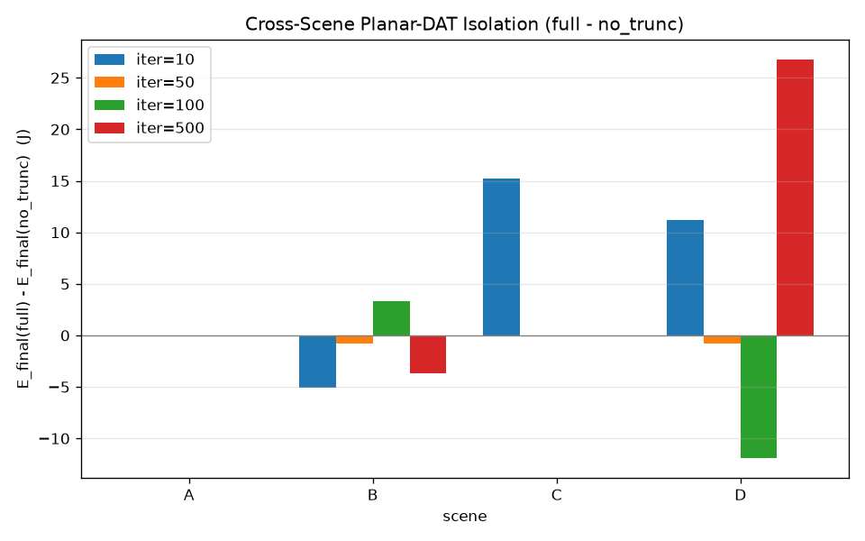

**Figure 14.** Grouped bar chart of `E_final(full) − E_final(no_trunc)` (J) by scene (x-axis, A–D) and iteration count (bar color), directly reproducing the table above. Scene A bars are all ≈0 (Planar-DAT has no effect when `particle_enable_self_contact=False` — there is nothing to truncate). Scene C shows a single large positive bar at iter=10 (+15.2J, the "truncation stabilizes" effect of Figure 9) with all other iteration counts ≈0 (truncation is irrelevant once the solver has converged, §5.3). Scenes B and D show smaller-magnitude bars of mixed sign across all four iteration counts, with Scene D's bars reaching the largest magnitudes of all (−11.9J at iter=100, +26.8J at iter=500) despite Figure 13 showing Scene D's *per-substep* truncation effect on KE is tiny — the large final-state differences in Scene D come from accumulated topological divergence over 7,200 substeps, not from any single substep's truncation magnitude (§6.4 finding 3).

### 7.3 Tangential Fraction

Across all scenes and iteration counts where truncation is active:

> **Tangential fraction ≈ 0.41–0.43** (constant)

This means ~42% of the displacement removed by Planar-DAT is perpendicular to the contact normal. Even in the frictionless scene (B, μ=0), Planar-DAT clips tangential motion — acting as an **implicit friction-like damper** that is not disabled by setting μ=0.

### 7.4 Damping Source Classification

```
                    STRUCTURAL      PLANAR-DAT       UNDER-CONVERGENCE
                    (implicit int.) (truncation)     (iter too low)
────────────────────────────────────────────────────────────────────────
Scene A (no contact)    ████████████      —               —
Scene B (sliding)       ██              ████████████    ███
Scene C (separating)    ███             ███ (stabilize) ████████ (iter<50)
Scene D (twisted)       ██              ████ (complex)  ████████
```

### 7.5 Effect of Substep Count (Timestep Size)

To separate the effect of dt from iteration count, a substep sweep was run on Scenes A (no contact) and B (frictionless sliding) with `iterations=100`, four ablation variants each.

#### Scene A — Structural Implicit Damping vs. dt

| substeps | dt (ms) | E_final (J) | E retained | ΔE/substep (J) | ΔE/s (J/s) |
|----------|---------|------------|-----------|----------------|-----------|
| 2  | 8.333 | −36.15 | −12.7% | 3.444 | 413.3 |
| 5  | 3.333 | −12.37 | −4.4%  | 1.594 | 478.1 |
| 10 | 1.667 |   5.89 |  +2.1% | 0.844 | 506.2 |
| 20 | 0.833 |  20.71 |  +7.3% | 0.425 | 510.3 |
| 40 | 0.417 |  25.96 |  +9.1% | 0.213 | 512.2 |

**Log-log fit**: `ΔE/substep ∝ dt^0.93 ≈ dt` — per-substep energy loss scales nearly linearly with the timestep size, as expected from backward-Euler implicit integration.

**Key finding**: `ΔE/s ≈ 500 J/s` is approximately constant across all substep counts. Halving dt (doubling substeps) halves the per-substep loss but doubles the substep count — the net dissipation rate per unit simulated time is invariant.

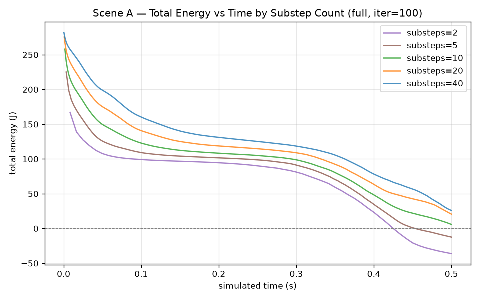

**Figure 15.** Total energy vs. simulated time for Scene A, `full`, iter=100, overlaid for substep counts ∈ {2, 5, 10, 20, 40} (i.e., dt ∈ {8.33, 3.33, 1.67, 0.83, 0.42}ms), all covering the same 0.5s simulated-time window. All five curves start from different initial energies (167–282J) because `end_of_step/total_energy[0]` already reflects one full step at that substep's dt — larger dt means more energy is lost in just the first step. By t=0.5s the curves have fanned out further: substeps=40 (blue) ends at +25.96J (+9.1% retained), substeps=20 (orange) at +20.71J (+7.3%), substeps=10 (green) at +5.89J (+2.1%), substeps=5 (brown) at −12.37J (−4.4%), and substeps=2 (purple) at −36.15J (−12.7%) — matching the table above exactly. The clear ordering (more substeps ⇒ smaller per-step dt ⇒ less energy lost over the same simulated-time window) is the direct visual evidence for the §7.5/§8.5 conclusion that structural implicit damping scales with dt, even though the *per-unit-time* dissipation rate (`ΔE/s`) is roughly constant across substep counts.

#### Scene B — Planar-DAT Truncation vs. dt (full variant, iter=100)

| substeps | dt (ms) | n_truncated | ΔKE_trunc/sub (J) | ΔKE_trunc/s (J/s) |
|----------|---------|------------|------------------|--------------------|
| 2  | 8.333 | 541.9 | 3.573 | 428.7 |
| 5  | 3.333 | 275.3 | 4.458 | 1337.4 |
| 10 | 1.667 | 115.1 | 1.353 | 811.5 |
| 20 | 0.833 |  40.4 | 0.425 | 509.4 |
| 40 | 0.417 |  30.3 | 0.333 | 798.5 |

**Log-log fit for n_truncated**: `n_trunc ∝ dt^1.04 ≈ dt` — fewer pairs truncated per substep at smaller dt, because per-substep particle displacements are smaller and less often exceed the conservative bound.

**Key finding**: Unlike Scene A, `ΔKE_trunc/s` is **non-monotonic**. At sub=5 (dt=3.33 ms), the truncation rate per unit time spikes to 1337 J/s — more than 2× the neighboring data points. This arises because the contact topology (which pairs are active) changes qualitatively at different dt values: large dt allows more pairs to accumulate before truncation fires, creating burst-mode truncation events.

**Tangential fraction** remains ≈ 0.42 across all substep counts, confirming that this is a geometric property of the truncation algorithm, not a dt artifact.

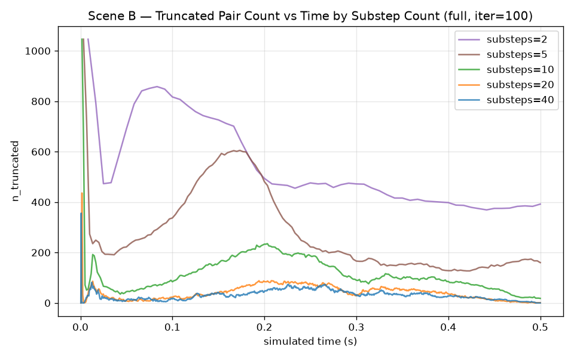

**Figure 16.** `truncation/n_truncated` vs. simulated time for Scene B, `full`, iter=100, overlaid for substep counts ∈ {2, 5, 10, 20, 40}, over the same 0.5s window. substeps=2 (purple, dt=8.33ms) shows by far the highest truncated-pair counts throughout (≈400–1050), consistent with the "n_trunc ∝ dt" scaling above — larger per-substep displacements at large dt exceed the conservative Planar-DAT bound far more often. substeps=5 (brown, dt=3.33ms) shows a distinctive broad hump peaking ≈600 around t=0.15–0.2s that is *not* present (or much smaller) for substeps=10/20/40 — this hump is the time-domain origin of the "non-monotonic ΔKE_trunc/s, spike at sub=5" finding above: at this particular dt, the contact topology produces a burst of truncation events that does not occur at neighboring dt values. substeps=10/20/40 (green/orange/blue) remain low (<250) throughout, with substeps=40 staying mostly below 50.

#### Summary

| Damping source | Per-substep scaling | Per-unit-time rate |
|---------------|--------------------|--------------------|
| Structural (backward-Euler) | ∝ dt^0.93 | ≈ constant (~500 J/s) |
| Planar-DAT truncation (Scene B) | ∝ dt^0.94 | non-monotonic (contact topology) |

---

## 8. Implications for Real-Time Simulation

### 8.1 Structural Implicit Damping Is Irreducible

Scene A demonstrates that even at iter=500 (fully converged), a 24×24 cloth loses 97.9% of its energy in 0.5 s. This cannot be fixed by adding more iterations. Mitigation requires:
- Smaller timestep dt (reduces per-step implicit damping)
- Higher-order time integration (e.g., BDF2, midpoint rule)
- Kinetic energy injection / velocity correction step

### 8.2 Planar-DAT Truncation Creates Iteration-Dependent Damping

In sustained-contact scenarios (Scene B), more iterations → more particle displacement → larger truncation → more KE removed. This creates an unfortunate trade-off: better convergence induces more contact damping.

The tangential component (42%) of truncation cannot be disabled by setting μ=0. Reducing tangential truncation requires either:
- Projecting the truncation scale to be applied only in the normal direction
- Accepting some penetration risk at the benefit of less tangential damping

### 8.3 Truncation as Stabilizer at Low Iterations

In brief-contact scenes (Scene C, iter=10), disabling Planar-DAT causes catastrophic instability (negative total energy). Truncation's conservative displacement bound serves as an implicit regularizer when the solver cannot fully resolve contact forces within the iteration budget.

### 8.4 Contact Density Introduces Non-Linear Behavior

In the twist-release scene (Scene D, ~40,000 contact pairs), the effect of Planar-DAT is non-monotonic with respect to iteration count: the solver converges to qualitatively different topological states depending on how aggressively truncation clips inertia displacements. This complicates any deterministic prediction of damping magnitude in real garment scenarios.

### 8.5 Increasing Substep Count Does Not Reduce Damping

A common expectation is that using more substeps (smaller dt) will reduce artificial dissipation — more steps should make the simulation "more accurate." This expectation is **incorrect for VBD**:

- **Structural backward-Euler damping**: per-substep loss ∝ dt, but substep rate ∝ 1/dt. The product — energy loss per unit simulated time — is constant regardless of substep count.
- **Planar-DAT truncation**: per-substep n_trunc ∝ dt, and per-substep ΔKE_trunc ∝ dt. Again the per-unit-time rate is roughly constant, though it is additionally sensitive to contact topology changes at different dt.

**Consequence**: doubling the substep count doubles the computational cost but does not improve energy conservation. Fixing structural damping requires a different time integration scheme (e.g., BDF2, symplectic integrators, or kinetic energy correction), not simply a finer timestep.

---

## 9. Experimental Configuration

| Parameter | Value |
|-----------|-------|
| Solver | `newton.solvers.SolverVBD` |
| Iterations | 10, 50, 100, 500 |
| Substeps/frame | 10 |
| dt | 1/600 s ≈ 1.667 ms |
| Device | NVIDIA RTX 4090 (cuda:1) |
| `dynamic_recoloring` | False (all runs) |
| `ogc_contact` | True (Scenes B, C, D) |
| `use_planar_dat` | True (`full`, `no_friction`) / False (`no_trunc`, `no_contact`) |
| Scenes A, B, C frames | 30 (0.5 s) |
| Scene D frames | 720 (12 s) |
| Total runs (iteration sweep) | 64 (4 scenes × 4 iter × 4 ablation) |
| **Substep sweep** | |
| Substeps/frame | 2, 5, 10, 20, 40 |
| dt range | 0.417 ms – 8.333 ms |
| Iterations | 100 |
| Scenes | A, B only |
| Total runs (substep sweep) | 40 (2 scenes × 5 substeps × 4 ablation) |

---

*Generated by VBDDiagnostics ablation framework — `scripts/run_damping_ablation.py` + `scripts/analyze_damping_logs.py`. Figures generated by `scripts/generate_report_figures.py` (time-series, from existing `runs/ablation_*/diagnostics.npz`) and `scripts/capture_scene_screenshots.py` (scene snapshots, from short re-simulations using the same `full`/iter=100 configuration).*
